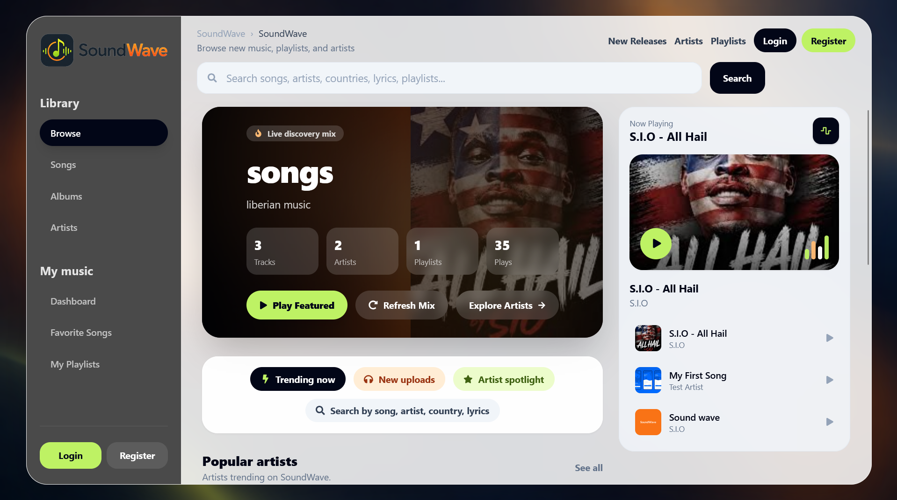
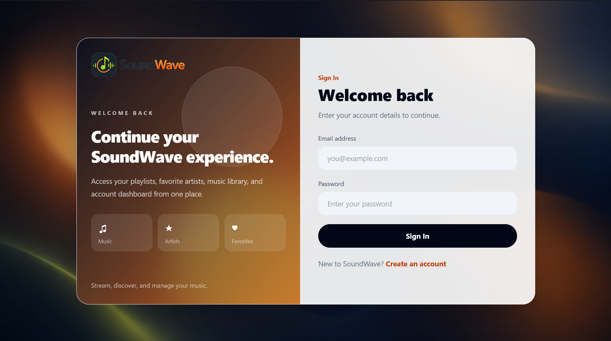
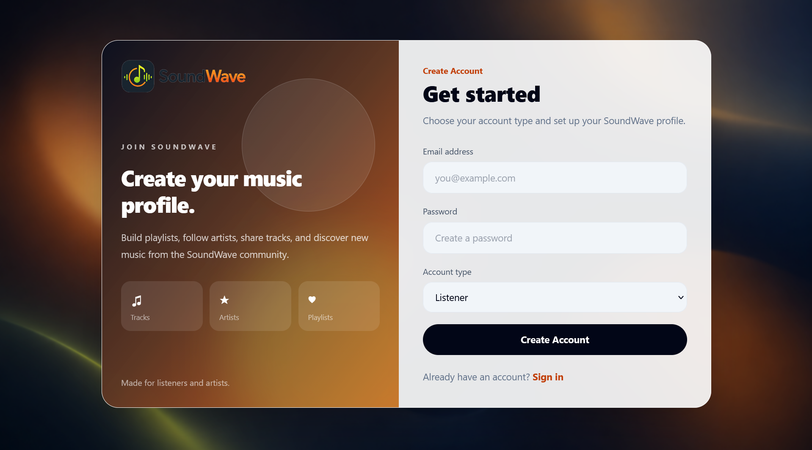
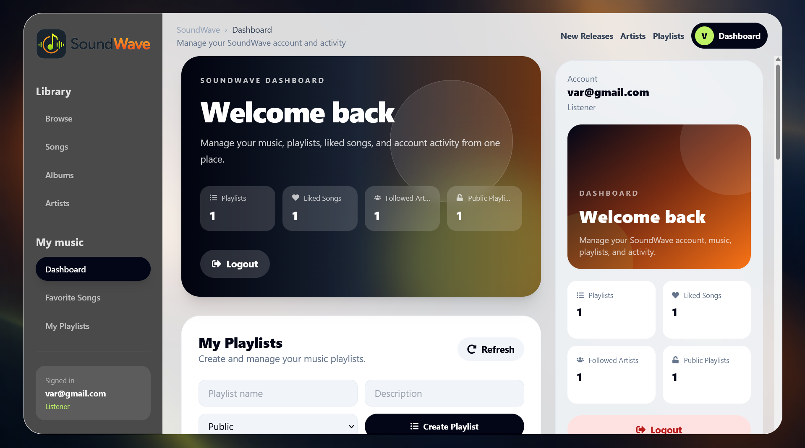
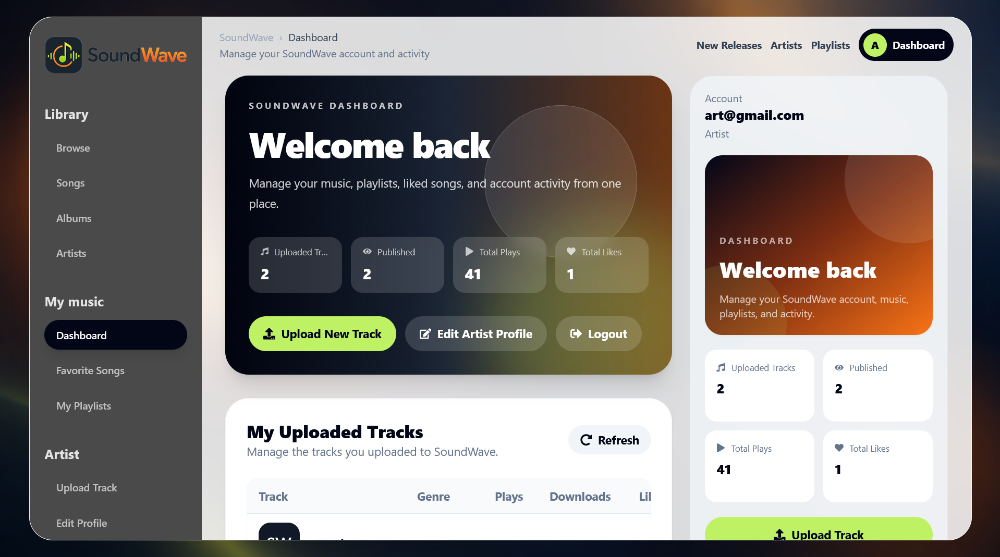
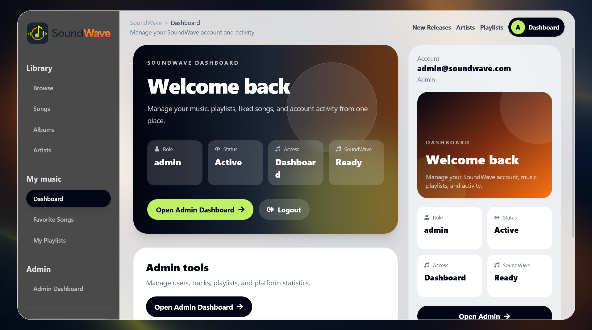
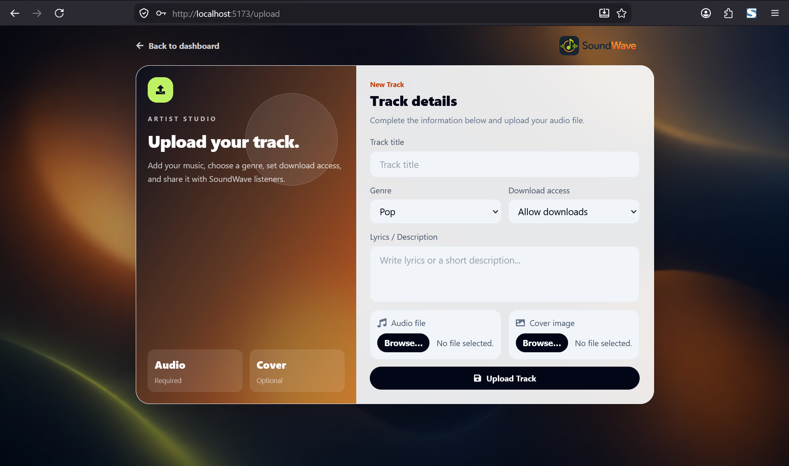
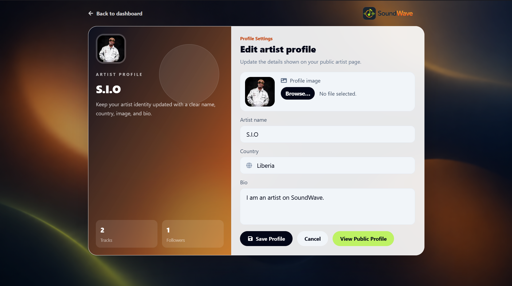
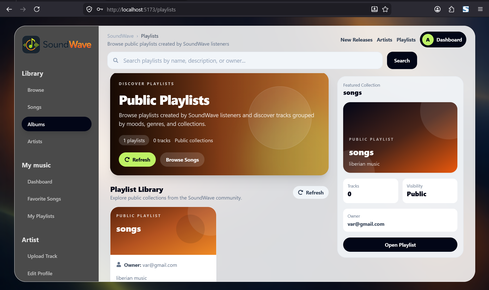
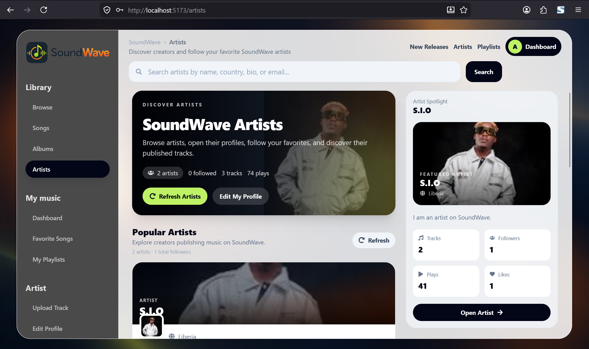

# SoundWave Music Platform

SoundWave is a full-stack music streaming platform built for listeners, artists, and administrators. The platform allows users to discover songs, follow artists, create playlists, like tracks, download music, upload tracks, and manage music content through role-based dashboards.

## Preview

### Home Page


### Login Page


### Register Page


### Listener Dashboard


### Artist Dashboard


### Admin Dashboard


### Upload Track


### Artist Profile


### Playlists


### Artists


---

## Features

### Listener

- Browse public songs, artists, and playlists
- Search songs by title, artist, lyrics, country, genre, or keywords
- Play, pause, like, and download songs
- Create and manage personal playlists
- Add tracks to playlists
- Follow artists
- View liked songs and followed artists from the dashboard

### Artist

- Create an artist profile
- Edit artist name, country, bio, and profile image
- Upload tracks with audio file, cover image, genre, lyrics, and download settings
- Manage uploaded music from the dashboard
- Edit or delete uploaded tracks
- View public artist profile

### Admin

- Monitor users, tracks, playlists, and platform activity
- Approve pending users
- Disable or delete users
- Hide or publish tracks
- Manage public playlists
- View platform statistics

---

## Tech Stack

### Frontend

- React
- Vite
- Tailwind CSS
- React Router
- Zustand
- Axios
- React Icons

### Backend

- Node.js
- Express.js
- MySQL
- JWT Authentication
- Multer File Upload

---

## Project Structure

```txt
soundwave/
├── client/
│   ├── src/
│   │   ├── api/
│   │   ├── assets/
│   │   │   └── screenshots/
│   │   ├── components/
│   │   ├── pages/
│   │   └── store/
│   └── package.json
│
├── database/
│
├── server/
│   ├── src/
│   │   ├── config/
│   │   ├── controllers/
│   │   ├── middleware/
│   │   ├── routes/
│   │   ├── utils/
│   │   └── app.js
│   └── package.json
│
├── INSTALLATION_GUIDE.md
├── PROJECT_DOCUMENTATION.md
├── README.md
└── .gitignore